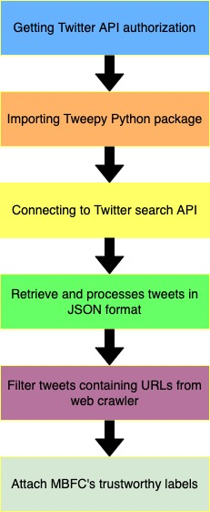

# CovidMis20 dataset (COVID-19 Misinformation 2020 dataset)

CovidMis20 dataset (COVID-19 Misinformation 2020 dataset) helps researchers differentiate between fake and real news related to COVID-19 on Twitter; CovidMis20 includes around 1,375,592 tweets from February to July 2020; also, CovidMis20 can be automatically updated to fetch the latest news.

If you use this dataset, we would appreciate it if you could cite our paper:
```
A. Mulahuwaish, M. Osti, K. Gyorick, M. Maabreh, A. Gupta, and B. Qolomany, “CovidMis20: COVID-19 Misinformation Detection System on Twitter Tweets using Deep Learning Models,” in the 14th International Conference on Intelligent Human Computer Interaction (IHCI-2022), Tashkent, Uzbekistan, Oct. 2022.
```

## Dataset Collection and Curation:
 
We collected more than 1.5 billion coronavirus-related tweets for more than 40 million users from January 22, 2020, until May 15, 2022, leveraging the Twitter standard search application programming interface (API) and Tweetpy Python library. A set of predefined search English keywords used such as (“corona,” “coronavirus,” “Coronavirus,” “COVID-19”, “stay at home,” “lockdown,” “Social Distancing,” “Epidemic,” “pandemic,” and “outbreak”), which are the most widely used scientific and news media terms relating to the novel coronavirus. We extracted and stored the text and metadata of the tweets, such as timestamp, number of likes and retweets, hashtags, language, and user profile information, including user id, username, user location, number of followers, and number of friends.

Typically, it is challenging to label data as “fake” or “real” news since the perception depends on one individual to another. We can, however, focus on facts that have been established medically or scientifically – and then decipher if these facts were incorrectly shared or twisted by individuals or websites while being posted on a platform. Using a determined list of websites classified as trustworthy or not – obtained from Media Bias Fact Check (MBFC) - a web-crawler tool was deployed to collect an initial URL-based (MBFC dataset) dataset. The web crawler tool used in this work is a Java-based tool to crawl the internet. The tool was executed to search the internet and find and report COVID-19-related sites in an output file.

The keywords used for the search were – Sars-cov-2, COVID-19, Coronavirus, and virus – to only get sites related to the COVID-19 information. Then we looked for COVID articles at each URL (for example, https://achnews.org). If a page contained at least six instances of the key terms: Sars-cov-2, COVID-19, Coronavirus, and virus, it was considered a COVID article. The scraper went through each domain page, searching for these keywords. For the pages considered COVID articles, only the URL was collected. The website content needed to contain any of the keywords mentioned above thrice to ensure a closer hit. This ensured that the words were not present in the infomercial listed or the extra information section. There is an assumption made when we think only these keywords represent sites containing COVID-19 information. Of course, more sites have other keywords present talking about the virus. The URLs from the MBFC dataset were classified as fake and real as per the predetermined list from the MBFC.

For Twitter data analysis, applications were used to clean the data as the tweets that had MBFC were classified, URLs in them were extracted, and fields like tweet date, location, tweet text, and tweet URL were identified and extracted from the data for problem-solving. Th figure below shows the data collection process. The first phase of data collection is registering a Twitter application and obtaining a Twitter access key and token. The second phase is to import the tweepy python package and write the python script for accessing Twitter API. The third phase is to connect to Twitter search API and retrieve tweets using some keywords related to COVID-19. The third phase reads and processes the data to extract information on tags, agents, and locations for network construction and analysis. The fourth phase filters Tweets containing URLs from a web crawler. The last phase is attaching MBFC labels, including trustworthy and untrustworthy ones.

<p align="center">
    
    <br/>
    <b>Figure 1</b>: Process for collecting tweet data
</p>
